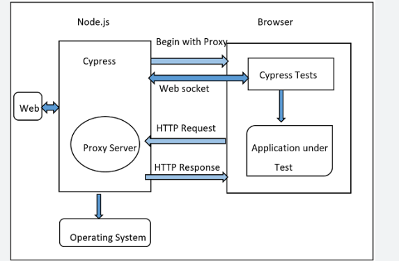
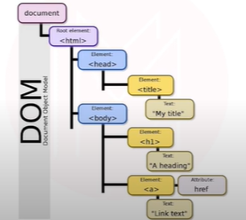
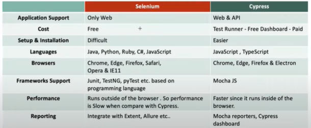
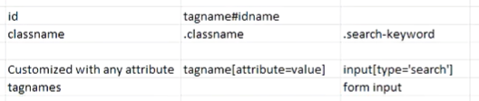
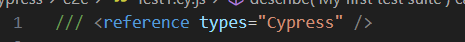

# Cypress Project 
Cypress Project

Cypress - front end Automation testing tool build for modern web applications.

NPM: Node Package Manager.

Setup: 
1) Install Node.js 
2) npm install
3) npm -i init
4) npm install cypress --save-dev
5) Start cypress command: npx cypress open (or) node_modules/.bin/cypress open

Cypress official document: https://docs.cypress.io/guides/end-to-end-testing/writing-your-first-end-to-end-test.

Cypress Architecture

Testing frameworks that come with Cypress: Chai & Mocha assertion libraries. We can't use TestNG or Junit in Cypress.

To interact with DOM element in Cypress: Use CSS Selector to interact with Cypress.

Can we use BDD with Cypress?
Cypress doesn't provide any official inbuilt support for BDD. However, the NPM Cypress-Cucumber-Preprocessor plugin lets us write tests in BDD Cucumber Syntax.

Cypress:
Frontent web application testing tool.
modern web applications for React JS, Angularjs.
Opensource

Cypress Eco system:
1) Testrunner - open source, locally installed.
2) Dashboard - paid

Node.js and comes with npm module.

Who can use Cypress - Dev & QA
1) End-to-End test cases
2) Integration tests
3) Unit test cases
4) API Testing

Features:
1) Time travel
2) Debuggability
3) Automatic waits(built-in waits)
4) Consistence results
5) Screenshots & videos
6) Cross browser testing - locally or remotely

Limitations:
1) Can't automate window based/mobile apps.
2) Limited supports
3) JavaScript/Typescript
4) Reading/writing data into file is difficult.
5) Thirsd party reporting tool integration is also limited.

Writing tests: https://docs.cypress.io/guides/end-to-end-testing/writing-your-first-end-to-end-test

Syntax: 

describe('suite name', () => {
  it('test1', () => {
    expect(true).to.equal(false) //assertions
  })
})

How Cypress is Unique from other Automation tool:
1) Automatic waits.
2) Ability to test Edge testcases by mocking the server response.
3) Cypress takes snapshots as tests run. We can hover over each commands in the Command Log to see exactly what happened at each step.
4) Cypress selivers fast, consistent, reliable text execution compared to other Automation tools.
5) View video of entier test execution when run from the cypress dashboard.

Selenium operate by running outside the browser and executing remote commands across the network. Cypress engine directly operates inside the browser. It is the browser that is executing your test code.
This enables Cypress to listen and modify the browser behaviour at run time by manuplating DOM. 

Cypress Browser Support:
1) Chrome
2) Electron
3) Firefox & IE (Under Construction)

Navigating to url - visit
Through command line, Cypress run in headless in chrome/elctron/firefox.
Update configuration in cypress.json which over rides existing behaviour.
Cypress suports CSS selector only.

./node_modules/.bin/cypress run

Headed mode:
./node_modules/.bin/cypress run --headed

Chrome Browsers:
cypress run --browser chrome

./nodemodules/.bin/cypress run --browser chrome

Firefox Browser:
./nodemodules/.bin/cypress run --browser firefox

Reference:

/// <reference types="Cypress" />
<reference types="Cypress" />

Cypress is asynchronous in nature and there is no guarantee in sequence of execution, but cypress takes care of it.

Asyncronous step returns Promise. Promise comes with 3 different states: rejection, resolved, pending.
'.then()' method 

https://docs.cypress.io/guides/core-concepts/introduction-to-cypress

# Git commands to push commit from local branch
git branch

git add . => stagging

git status

git commit -m "message" => Ex: git commit -m "adding test file"

git push

git branch

git checkout main

git merge -m "merge message" localbranchname

git push origin main

# cypress
To run specific file => npx cypress run --spec relativepath
Ex: npx cypress run --spec cypress\e2e\Tests\3_MyFirstTest.cy.js 

To run on specific browser => npx cypress run --browser chrome

Headed mode => npx cypress run --browser chrome --headed

Hierarchy 
TestSuite -> TestCase -> Test Steps

Spec File(cy.js) ---> describe blocks(test suites) ---> it blocks(test)

